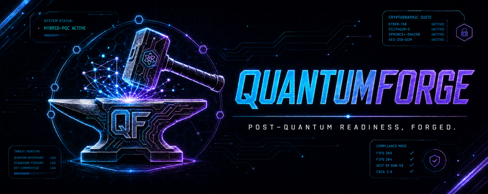

# QuantumForge

QuantumForge is a policy-as-code post-quantum cryptography (PQC) readiness framework. It combines Terraform reference modules, Rego policies, credential-free tests, isolated AWS runtime tests, and evidence controls.

It intentionally distinguishes:

- **pure post-quantum signing:** AWS Key Management Service (KMS) ML-DSA, standardized by NIST FIPS 204
- **hybrid key establishment:** AWS Elastic Load Balancing (ELB) policies that negotiate classical plus ML-KEM groups while retaining classical client compatibility
- **measurement from remediation:** the vendor-neutral inventory is the system of record; cloud modules are integrations and reference implementations, not the inventory definition

## What is implemented

| Area | Implementation |
|---|---|
| Inventory | AWS Terraform-plan discovery plus a versioned vendor-neutral schema for AWS, Azure, GCP, on-prem, SaaS, and application assets |
| Risk | Separate inherent risk, migration urgency, remediation effort, and evidence confidence |
| Governance | Owned, approved, expiring exceptions that fail closed when invalid |
| KMS | Pure `ML_DSA_44`, `ML_DSA_65`, or `ML_DSA_87` signing key module |
| TLS | Application Load Balancer HTTPS listener with an exact allowlist of recommended AWS hybrid PQ-TLS policies |
| Offline tests | Terraform native mock-provider tests, Open Policy Agent (OPA) tests, Conftest policy tests, schema validation, infrastructure-as-code (IaC) scans, and Cryptographic Bill of Materials (CBOM) generation |
| Live tests | AWS KMS sign/verify plus independent OpenSSL verification; ALB `X25519MLKEM768` and classical `X25519` runtime handshakes |
| Evidence | Explicit assessment states, SHA-256 manifests, GitHub artifact attestations, and optional seven-year S3 Object Lock publishing |

## Repository layout

```text
modules/
  pqc-kms-signing/          Pure FIPS 204 ML-DSA signing
  hybrid-pqc-alb/           ALB HTTPS hybrid PQ-TLS listener
policies/
  discovery/                Terraform-plan cryptographic discovery
  inventory/                Vendor-neutral inventory checks and metrics
  scoring/                  Risk, urgency, effort, and confidence
  governance/               Exception validation
  hybrid/                   Deployment rules executed by Conftest
schemas/                    Versioned inventory schema
examples/                   Generated plan, inventory, and governance test inputs
tests/live/                 Temporary AWS KMS and ALB test resources
scripts/aws/                Guarded runtime lifecycle tests
.github/workflows/          Credential-free PR CI and manual OpenID Connect (OIDC) live tests
```

## Terms used in this repository

- **Test fixture:** generated test input or temporary cloud resource created only for validation.
- **Fail closed:** missing, malformed, or contradictory data stops the assessment instead of being treated as compliant or empty.
- **Inventory collection:** conversion of a Terraform plan into the canonical cryptographic inventory. Some script and directory names retain the earlier term `census`.
- **Evidence profile:** the required set of files for one validation mode: offline policy checks, live KMS signing, or live ALB TLS negotiation.
- **Provenance attestation:** a signed statement linking an evidence bundle to the GitHub workflow and commit that created it.
- **Protected GitHub environment:** branch, approval, and variable restrictions applied before a sensitive workflow job can run.
- **Cleanup safety net:** the hourly workflow that removes expired tagged AWS test resources if normal test cleanup cannot run. Its filename and protected environment retain the legacy internal name `janitor`.

## Prerequisites

- Terraform >= 1.8
- OPA and Conftest
- Python 3.11+
- `jq`
- Docker for the pinned OpenSSL 3.5.7 runtime image
- AWS CLI v2 only for manually authorized live tests

## Credential-free development

Both deployable root modules are disabled by default, so local validation and pull-request CI do not contact AWS.

```bash
terraform init -backend=false -lockfile=readonly
terraform fmt -check -recursive
terraform validate
terraform test

terraform -chdir=modules/pqc-kms-signing init -backend=false -lockfile=readonly
terraform -chdir=modules/pqc-kms-signing test

terraform -chdir=modules/hybrid-pqc-alb init -backend=false -lockfile=readonly
terraform -chdir=modules/hybrid-pqc-alb test

opa test -v policies
```

Exercise the Conftest gate without credentials:

```bash
# Expected pass
conftest test examples/sandbox/mock-plan-hybrid-pass.json --policy policies

# Expected denial: classical KMS signing and classical TLS
conftest test examples/sandbox/mock-plan-classical-fail.json --policy policies
```

The gate uses exact key-spec and security-policy allowlists. A value that merely contains `ML_DSA` or `PQ` does not pass.

## Terraform modules

### `modules/pqc-kms-signing`

Creates an AWS KMS asymmetric `SIGN_VERIFY` key and alias using FIPS 204 ML-DSA. The module is **not** a hybrid classical-plus-PQC signature construction. Automatic KMS rotation is unavailable for asymmetric keys, so rotation requires a new key and controlled application migration.

AWS Provider 6.2 or later is required because ML-DSA support is unavailable in the repository's former 5.x constraint. Lockfiles make the tested provider selection reproducible.

### `modules/hybrid-pqc-alb`

Creates an **Application Load Balancer** `HTTPS` listener. It does not create a Network Load Balancer listener. NLB listeners use `protocol = "TLS"` and should be implemented and tested through a separate module contract.

The default policy is `ELBSecurityPolicy-TLS13-1-2-Res-PQ-2025-09`. Overrides must match the exact recommended PQ policy allowlist in `variables.tf`.

## Inventory and policy

Terraform discovery currently covers KMS, ELB listeners, AWS Certificate Manager (ACM) certificates, ACM Private Certificate Authority, CloudFront, API Gateway custom domains, and Site-to-Site VPN connections. Provider-managed or incomplete algorithm data stays `unknown`.

The canonical cross-platform model is [`schemas/crypto-inventory.schema.json`](schemas/crypto-inventory.schema.json). See [Inventory](docs/INVENTORY.md), [Governance](docs/GOVERNANCE.md), and the [Roadmap](ROADMAP.md).

## CI and live AWS validation

`pqc-compliance-gate.yml` is credential-free and safe for pull requests. It fails on Terraform, OPA, Conftest, schema, Checkov, Trivy, CBOM, or evidence-generation errors. Its normalized inventory uses `assessment_scope: synthetic_fixture`, meaning it was generated from test data. It proves framework behavior and never represents an AWS environment assessment.

`aws-live-pqc-validation.yml` is manually triggered in a protected GitHub environment and authenticates through OIDC. It requires a dedicated sandbox account, an account-ID guard, a concurrency lock, timeouts, tagged resources, in-process cleanup, a post-job cleanup check, and the hourly cleanup safety net for expired test resources. The ALB job is optional because it creates a paid resource.

See [Live AWS validation](docs/AWS_LIVE_TESTS.md).

## Evidence

Valid states are:

- `assessment_complete`
- `no_assets_found`
- `collection_failed`
- `not_assessed`

Only the first two can produce a complete evidence bundle. GitHub keeps a short-term 30-day copy. A protected job that runs only after a push to `main` creates a provenance attestation for the exact synthetic-test evidence ZIP. Seven-year retention is claimed only when that protected workflow publishes the ZIP to a separately administered S3 Object Lock bucket configured for at least 2,555 days.

See [Evidence integrity and retention](docs/EVIDENCE.md).

## Validation status

The current implementation was exercised with:

| Check | Result |
|---|---|
| Root `terraform validate` and format check | Passed |
| Terraform native mock tests | Root 2/2, KMS 6/6, ALB 5/5 passed without credentials |
| OPA 1.18.2 | 42/42 tests passed |
| Conftest | Generated hybrid plan passed; generated classical-only plan was denied with 2 failures; malformed plan was blocked |
| Checkov 3.3.8 / Trivy 0.69.2 | Zero blocking findings; scanner images pinned by digest |
| Live AWS KMS | `ML_DSA_65` created, KMS sign/verify passed, OpenSSL 3.5.7 verification passed, key entered `PendingDeletion` |
| Live AWS ALB | TLS 1.3 negotiated `X25519MLKEM768`; classical fallback negotiated `X25519`; temporary-resource cleanup enforced |
| Live AWS cleanup safety net | Targeted-run and expired-resource modes removed tagged VPC/security-group test resources; residual count was zero |

The repository does not claim that mocks emulate cryptography. Platform behavior is claimed only where the isolated live tests exercise the real AWS API and network path.

## Standards and references

- [NIST FIPS 203: ML-KEM](https://csrc.nist.gov/pubs/fips/203/final)
- [NIST FIPS 204: ML-DSA](https://csrc.nist.gov/pubs/fips/204/final)
- [AWS KMS ML-DSA documentation](https://docs.aws.amazon.com/kms/latest/developerguide/mldsa.html)
- [AWS ALB security policies](https://docs.aws.amazon.com/elasticloadbalancing/latest/application/describe-ssl-policies.html)
- [AWS KMS pricing](https://aws.amazon.com/kms/pricing/)
- [AWS ELB pricing](https://aws.amazon.com/elasticloadbalancing/pricing/)

## Contributing

See [CONTRIBUTING.md](CONTRIBUTING.md), [SECURITY.md](SECURITY.md), and [CODE_OF_CONDUCT.md](CODE_OF_CONDUCT.md). New platform claims need both deterministic contract tests and isolated live verification with cleanup and cost guardrails.
